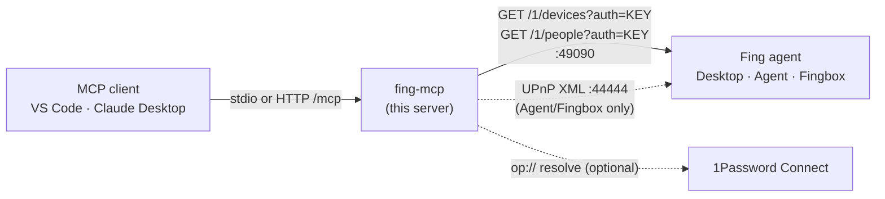

# Fing MCP

A read-only [Model Context Protocol](https://modelcontextprotocol.io) server for the
[Fing Local API](https://www.fing.com/integrations/local-api/). Ask an AI assistant what's on your
network, what just joined, what's offline, and who's home — answered from your own Fing agent,
without anything leaving the LAN.



## Tools

| Tool | What it does | Agents |
|---|---|---|
| `list_devices` | All devices, sorted by IP. Filters: `state` (UP/DOWN), `search`, `device_type`, `changed_within_hours`, `new_within_hours` | All |
| `get_device` | One device by MAC (any separator), IP or name; adds `ownerName` when available | All |
| `get_network_summary` | Online/offline counts, breakdown by type and make, unidentified devices, newest and recently changed | All |
| `list_people` | Contacts and presence (ONLINE/OFFLINE); avatars omitted unless `include_pictures` | Fing Desktop |
| `get_agent_status` | Connection self-test of each endpoint plus agent identity — run this first if anything fails | All |

All tools are read-only (annotated `readOnlyHint`) and publish an `outputSchema`; results use the
Fing API's own field names, with empty fields omitted.

## 1. Enable the Local API in Fing

* **Fing Desktop:** Profile menu → **Agent Settings** → **Local API** → Enable.
* **Fing Web App / Fingbox / Fing Agent:** Manage → Settings → **Local API** → Enable.

Note the **port** (default `49090`) and the **API key**.

## 2. Install

```powershell
git clone https://github.com/th3Wheel/Fing_mcp.git
cd Fing_mcp
py -3.12 -m venv .venv
.venv\Scripts\pip install -r requirements.txt
copy .env.example .env   # then edit FING_API_KEY / FING_API_BASE_URL
```

Python 3.11+ is required. On Linux/macOS use `python3 -m venv .venv && .venv/bin/pip install -r requirements.txt`.

## 3. Connect a client

### VS Code (GitHub Copilot agent mode)

The repo ships [`.vscode/mcp.json`](.vscode/mcp.json), which launches the server from `.venv` and reads
`.env`. Open the folder in VS Code, open `mcp.json`, and click **Start** above the `fing` entry.
On Linux/macOS change the command to `${workspaceFolder}/.venv/bin/python`.

### Claude Desktop

Add to `%APPDATA%\Claude\claude_desktop_config.json`:

```json
{
  "mcpServers": {
    "fing": {
      "command": "C:\\Users\\gitHub\\GitHub\\Fing_mcp\\.venv\\Scripts\\python.exe",
      "args": ["C:\\Users\\gitHub\\GitHub\\Fing_mcp\\server.py"],
      "env": {
        "FING_API_KEY": "your-key",
        "FING_API_BASE_URL": "http://localhost:49090"
      }
    }
  }
}
```

### Any client over HTTP (Docker)

```bash
cp .env.example .env          # set FING_API_KEY; FING_API_BASE_URL defaults to the Docker host
docker compose up -d --build
curl http://localhost:8000/healthz
```

The MCP endpoint is `http://localhost:8000/mcp` (streamable HTTP). It has **no authentication**, so
Compose publishes it on loopback only. To reach it from other machines set `MCP_BIND=0.0.0.0` (or a
LAN IP) in `.env`, and keep it on a trusted network or behind an authenticating reverse proxy.

> **Fing Desktop and remote access:** if the server runs on a different machine than Fing Desktop
> (for example in Docker on Proxmox), make sure the Windows firewall allows inbound TCP 49090. Fing
> Agent and Fingbox are reachable on the LAN by design.

## Configuration

| Variable | Default | Notes |
|---|---|---|
| `FING_API_KEY` | — | **Required.** Literal key or `op://vault/item[/field]` |
| `FING_API_BASE_URL` | `http://localhost:49090` | Host:port of the agent; trailing `/1` optional |
| `FING_TIMEOUT` | `10` | Seconds per request |
| `FING_RETRIES` | `2` | Connection retries |
| `FING_AGENT_INFO_PORT` | `44444` | UPnP identity port used by `get_agent_status` |
| `MCP_TRANSPORT` | `stdio` | `stdio`, `http` or `sse` (Docker image defaults to `http`) |
| `MCP_HOST` / `MCP_PORT` | `127.0.0.1` / `8000` | HTTP bind address inside the process/container |
| `MCP_BIND` / `MCP_PUBLISH_PORT` | `127.0.0.1` / `8000` | Compose only: host address/port to publish on |
| `OP_CONNECT_HOST` / `OP_CONNECT_TOKEN` | — | 1Password Connect for `op://` keys; the token must be literal |
| `LOG_LEVEL` | `INFO` | Logs go to stderr; the API key is never logged |

### 1Password (optional)

Set `FING_API_KEY=op://Vault/Fing/credential`, put `1password-credentials.json` next to
`docker-compose.yml`, set `OP_CONNECT_HOST=http://op-connect-api:8080` and `OP_CONNECT_TOKEN`, then:

```bash
docker compose --profile onepassword up -d --build
```

## Troubleshooting

Ask the assistant to run **`get_agent_status`**. It reports each check separately:

* `HTTP 401` — key mismatch; copy it again from Fing's Local API settings.
* `Could not reach the Fing agent` — wrong host/port, Local API disabled, or a firewall.
* `peopleEndpoint` 503 — expected on Fing Agent/Fingbox; `/people` is Fing Desktop only.
* `agentInfo` unavailable — expected on Fing Desktop; UPnP identity is Agent/Fingbox only.

## Development

```bash
pip install -r requirements-dev.txt
make test      # pytest (mocked Fing agent, no network needed)
make lint      # ruff + manifest freshness check
make manifest  # regenerate mcp.json after changing a tool
make docker-test
```

`mcp.json` is a generated manifest of the tool schemas; CI-style tests fail if it drifts from `server.py`.

## API reference

* Fing Local API v1.1.0 — https://www.fing.com/integrations/local-api/
* Enabling it — https://help.fing.com/hc/en-us/articles/26375898278940
* Request format cross-checked against Home Assistant's
  [`fing_agent_api`](https://pypi.org/project/fing-agent-api/) client.
